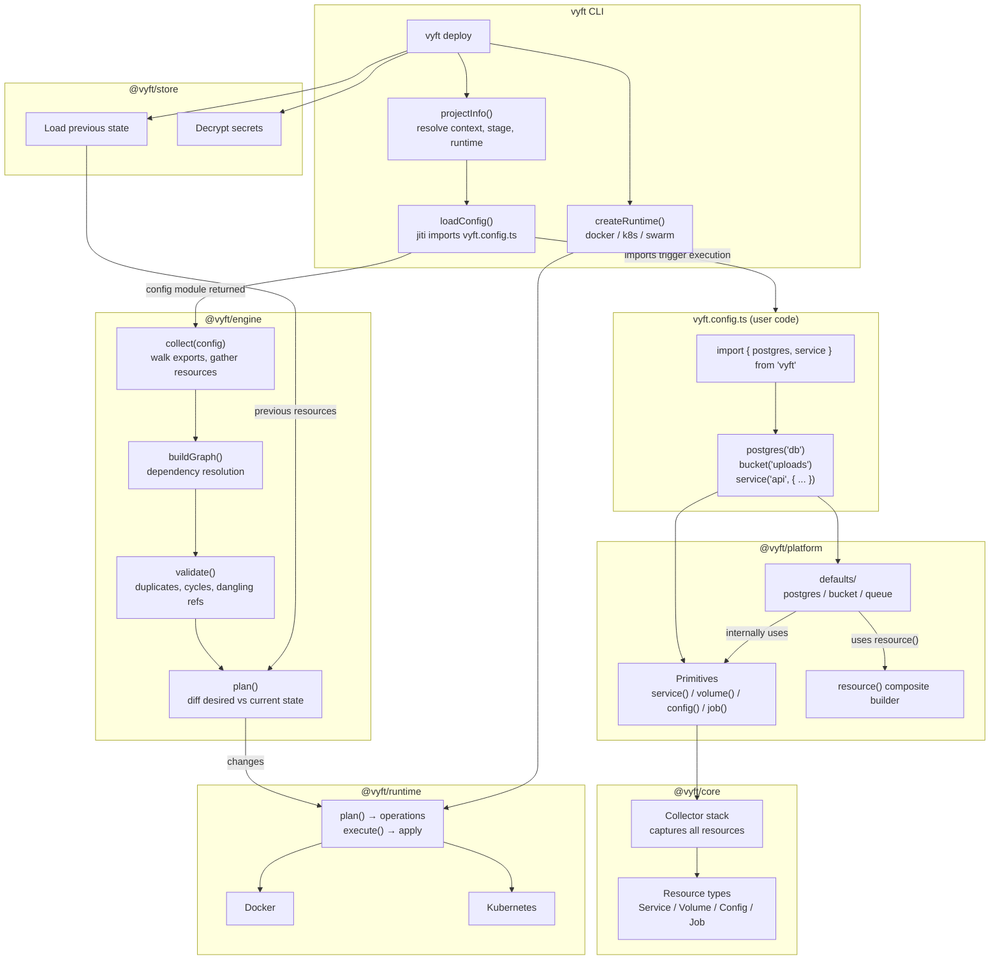
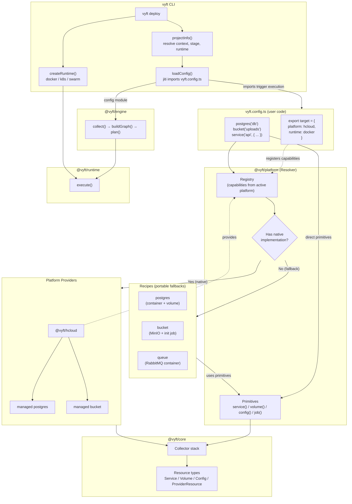
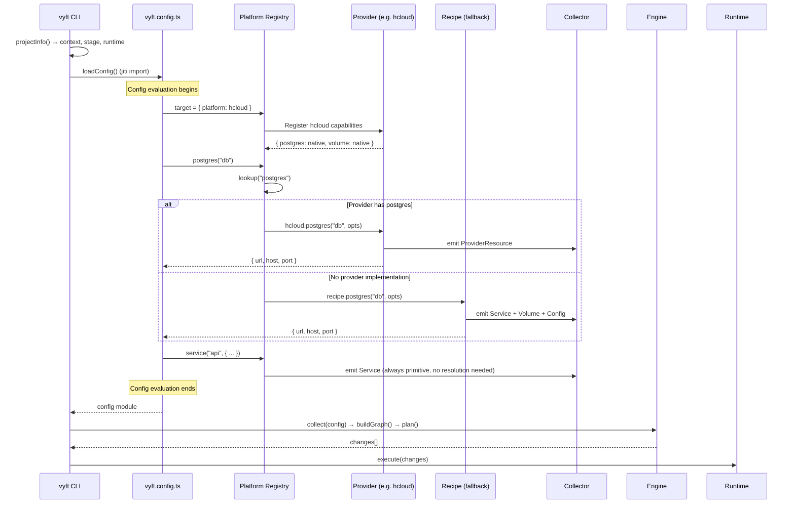

# Recipe & Platform Resolution Architecture

## Current Flow (as-is)

## Proposed Flow (with platform resolution)

## Resolution Sequence

## Key Design Points

1. **CLI orchestrates everything** - it's the entry point that loads config, resolves state, and drives the engine
2. **Config evaluation is where resolution happens** - when `vyft.config.ts` is imported via jiti, all `postgres()` / `bucket()` calls execute immediately
3. **Platform registry is populated by the target declaration** - the user's config specifies which platform is active
4. **Same output interface regardless of path** - user code gets `{ url, host, port }` whether it's a managed DB or a container
5. **Primitives bypass resolution** - `service()`, `volume()`, `config()`, `job()` go straight to the collector, no platform lookup needed
6. **Recipes are the default** - if no platform is set, or the platform doesn't implement a capability, the portable recipe always works
